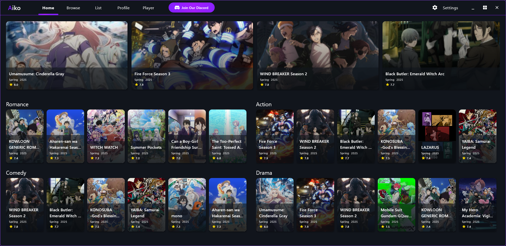

<div align="center" style="display: flex; align-items: center; gap: 10px;">
    
    <h1 style="margin: 0;">Your anime browser and tracker</h1>
</div>

## Anime Browser & Watchlist Manager

A **Kotlin Multiplatform Compose** desktop app to browse anime, manage your
personal watchlists from **AniList** or **MAL**, and watch anime directly in an embedded player.
Includes synced watch parties with friends and **Discord Rich Presence** support.

## Installation

### Windows

<details>
<summary>

#### winget

</summary>

```powershell
winget install -e --id Dubsky.Aiko --silent
```

</details>

<details>
<summary>

#### Scoop

</summary>

```powershell
scoop bucket add dubskysteam_scoop-bucket https://github.com/dubskysteam/scoop-bucket
scoop bucket install aiko
```

</details>

<details>
<summary>

#### Manual

</summary>

1. Download the latest release from the [Releases](https://github.com/dubskysteam/aiko/releases) page.
2. Run the installer and follow the instructions.
3. Launch the app from the Start menu.

</details>

### Linux
_(Only as self-built for now, a until stable version is achieved and then published on the package managers)_

## Features

- 🔥 **Explore Trending & Seasonal Anime** – Stay up to date with the latest hits.
- 🔍 **Browse the AniList Database** – Search and view detailed anime information.
- 🎥 **Embedded Video Player** – Watch anime directly in the app.

## Coming soon
- 👫 **Watch Together** – Sync up with friends and enjoy anime together.
- 🎮 **Discord RPC Integration** – Show what you're up to in Discord.
- 📺 **Desktop Notifications** – Get notified when new episodes are available.

## Roadmap

- [X] Basic UI for browsing anime
- [X] Implement AniList API integration (search, trending etc.)
- [X] Add user authentication for AniList
- [X] Implement embedded video player
- [X] Themes and config
- [ ] Implement watchlist management
- [ ] Implement "Watch Together"
- [ ] Improve UI/UX for a seamless experience
- [ ] Implement Discord Rich Presence
- [ ] Implement Desktop Notifications

## Screenshots

### Home Screen


### Browse Screen


### Player Screen

